# Procesverslag

Markdown is een simpele manier om HTML te schrijven.  
Markdown cheat cheet: [Hulp bij het schrijven van Markdown](https://github.com/adam-p/markdown-here/wiki/Markdown-Cheatsheet).

Nb. De standaardstructuur en de spartaanse opmaak van de README.md zijn helemaal prima. Het gaat om de inhoud van je procesverslag. Besteedt de tijd voor pracht en praal aan je website.

Nb. Door _open_ toe te voegen aan een _details_ element kun je deze standaard open zetten. Fijn om dat steeds voor de relevante stuk(ken) te doen.

## Jij

  
uitwerken voor kick-off werkgroep

### Auteur:

Douwe Kiebert

#### Je startniveau:

Rood

#### Je focus:

Responsive plane

## Je website

  
uitwerken voor kick-off werkgroep

### Je opdracht:

De website die ik wil namaken: (https://smiski.com/e/)

#### Screenshot(s) van de eerste pagina (small screen):

Home pagina

#### Screenshot(s) van de tweede pagina (small screen):

News pagina

## Toegankelijkheidstest 1/2 (week 1)

  
uitwerken na test in 2e werkgroep

  
  Toegangkelijkheidstest Resultaten:
  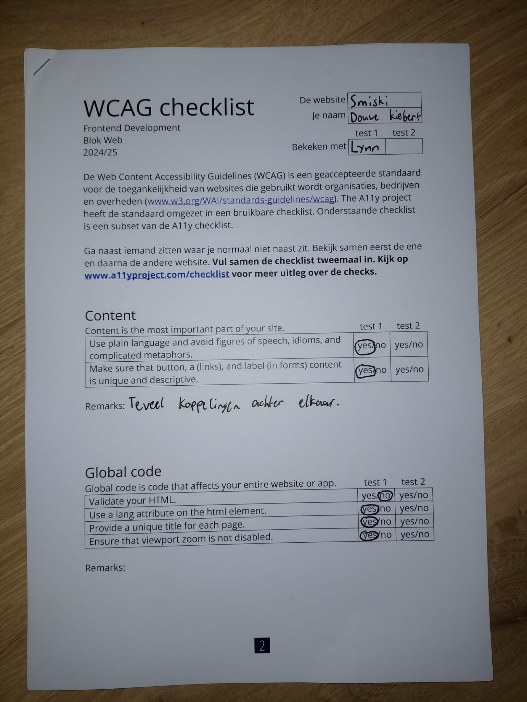
  
  
  
  

### Bevindingen

- Er staan geen duidelijke namen bij de afbeeldingen.
- Je kan gek worden van hoe vaak hij koppeling zegt.
- Afbeeldingen zijn Headers.
- Oprechte headers zijn best duidelijk.
- Nederlands lezen werkt slecht want de website is in het engels.
- De naam smiski herkent hij niet en word dus helemaal uitgespeld.
- Hij leest de tekst van de afbeeldingen twee keer, best onnodig.
- Rare tekentjes in de tekst zorgen ervoor dat hij confused raakt.
- De html heeft nog heel veel error messages.
- Er is geen h1 en de headings beginnen pas bij h3.
- Sommige images hebben geen alt texts of text versie indien nodig is.
- Er is geen transcipt mogelijk voor de youtube video.
- Er is geen skip link voor de screenreader.
- Er is geen support voor dark/light of high-contrast mode, en bij sommige elementen is het kleurverschil niet goed genoeg.

## Breakdownschets (week 1)

  
uitwerken na afloop 3e werkgroep

### Home pagina:

  

### News pagina:

  

## Voortgang 1 (week 2)

  
uitwerken voor 1e voortgang

### Stand van zaken

Het is mij gelukt de html proberen op te stellen van 1 van de pagina's, alleen ik heb nog veel moeite met bepalen wat er in moet, en wat later met css moet gebeuren. Daarnaast heb ik nog veel moeite met het aantal images dat erin moeten, en heb ik nog geen idee hoe bijvoorbeeld je er een slideshow van moet maken. Ook zijn de social media links en youtube links nog erg onduidelijk. Het voelt als veel content waarvan ik nog geen idee heb hoe ik het ga aanpakken, en dan ook nog eens meer accesiable moet maken. Ook heb ik ervoor gekozen om mijn breakdownschets te maken na dit gesprek, omdat ik merkte nog veel moeite te hebben met alles indelen in wat het zou moeten zijn. Nu kan ik het alleen nog maar met div's maken wat natuurlijk niet hoort.

Zie afbeeldingen hieronder voor meer duidelijkheid.

   
   

### Agenda voor meeting

Iedereen had helemaal geen tijd om samen te komen zitten.

### Verslag van meeting

hier na afloop snel de uitkomsten van de meeting vastleggen

- Div's wegwerken en meer sections gebruiken.
- Voor de sections een invisible header gebruiken zodat het door screenreaders is te lezen.
- Span weghalen en UL van maken.
- Op de news pagina kan je de pagina nummer scroller maken met UL.
- Taal naar Engels veranderen.
- Toegangkelijkheidstest toevoegen aan README.
- H1 zien te verwerken en H3's die er nu in staan veranderen.
- Logo in H1 zetten op home pagina.

## Voortgang 2 (week 3)

  
uitwerken voor 2e voortgang

### Stand van zaken

Ik ben begonnen met de CSS, maar er zijn nog een paar HTML zaken die ik nog niet weet hoe ik die precies moet toepassen. Om alsnog verder te kunnen heb ik zoveel mogelijk gedaan qua CSS, alleen naar mijn idee kan de manier hoe ik dingen heb gecodeerd makkelijker en efficienter, dus ga ik hier naar vragen. Daarnaast heb ik ook allemaal vragen over CSS en JS zaken zoals hoe ik bijvoorbeeld het beste de image slideshows kan aanpassen.

Dingen om naar te vragen:

- Hoe kan je het beste te werk gaan met het maken van de image slideshow, en daar ook de pijlen aan toe te voegen?
- Hoe zorg je ervoor dat je een image hebt waar als je er over heen hoverd, er tekste verschijnt?
- Hoe kan je het beste alles op de pagina scalen om het telefoon formaat te maken?
- Hoe krijg je de iconen voor de socials zonder images te gebruiken?
- Hoe maak je images clickable?
- Hoe gebruik je precies forms? (ik zou niet weten hoe ik deze in mijn website moet toepassen)
- Hoe kan ik mijn CSS verbeteren en overzichtelijker maken?

Visuele ondersteuning van waar ik tegen aanloop:

### Agenda voor meeting

De helft van het groepje ging niet komen opdagen dus zijn we niet samen gaan zitten.

### Verslag van meeting

hier na afloop snel de uitkomsten van de meeting vastleggen

- De nav items kunnen in een details element.
- De socials iconen zijn een font, maar het beste is om er svg's van te vinden.
- News en updates stukje kan met position absolute, opacity, en active/hover states (moeten nog wel afbeeldingen bij).
- CSS alle algemene element structures bij elkaar zetten, daarna specifiek gaan aanspreken.
- Youtube video is gewoon goed.
- Alle elementen moeten natuurlijk nog netjes geplaats worden.
- Focus moet vooral liggen op flexbox en grids om het responsive te maken.
- HTML klopt maar mist nog een paar dingen zoals de images clickable maken en een form uitwerken.
- De image slideshow kan door het met flexbox naast elkaar te zetten, en dan overflow en scroll snap toe te passen.
- Header levels kloppen.
- Afbeeldingen gaan downloaden en niet meer de links gebruiken.

## Toegankelijkheidstest 2/2 (week 4)

  
uitwerken na test in 9e werkgroep

Toegangkelijkheidstest Resultaten:
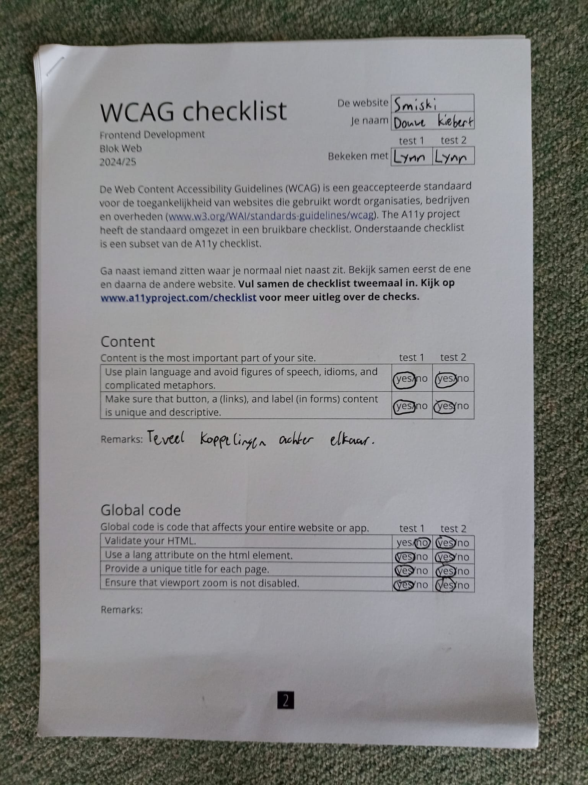
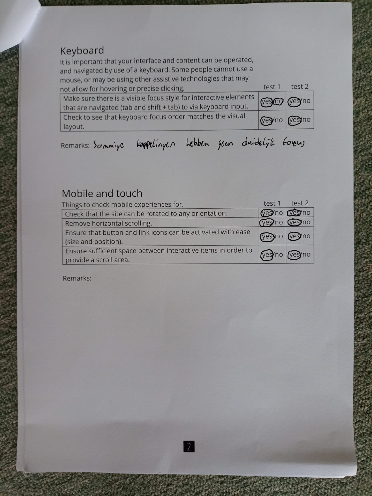

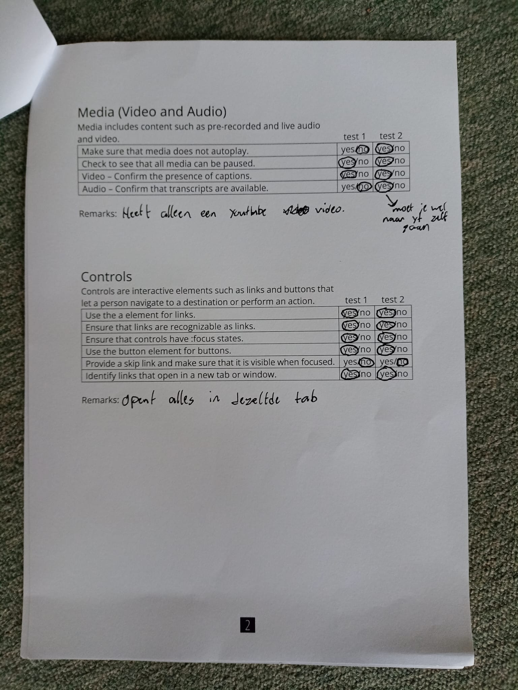
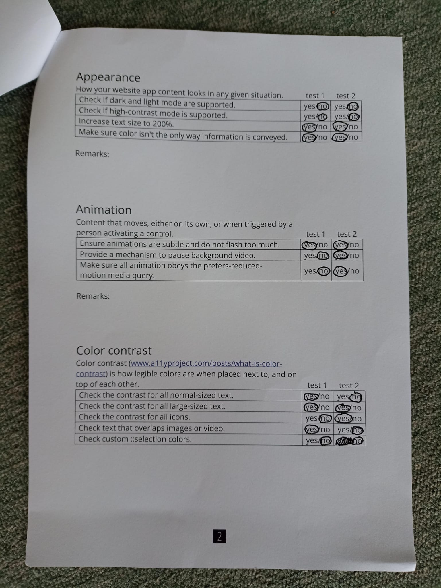

### Bevindingen

- Word nogsteeds heel vaak koppeling of heading level aangegeven en gezegd.
- De HTML is nu wel netjes en dus ook goed gekeurd door de validation.
- Heading levels zijn nu netjes aflopend en beginnen ook daadwerkelijk bij h1.
- Alle img elementen hebben nu wel een alt tekst.
- Skip link moet nog toegevoegd worden.
- Er moet nog veel gedaan worden aan vormgeving, zoals reduced-motion, contrasten en verschillende modes zoals dark/light en high-contrast.

## Voortgang 3 (week 4)

  
uitwerken voor 3e voortgang

### Stand van zaken

Waar ik deze week vooral tegen aan loop is vormgeving. De elementen hebben allemaal whitespace eromheen die er niet hoort te zijn, de image slideshows zijn verschillende grotes wat niet hoort, en het lukt niet om ze te laten snappen met scroll snap. Het zijn allemaal dingetjes waarvan ik denk dat ze makkelijk opgelost kunnen worden, maar het lukt mij op dit moment niet om die oplossing te vinden.

Visuele ondersteuning van waar ik tegen aanloop:

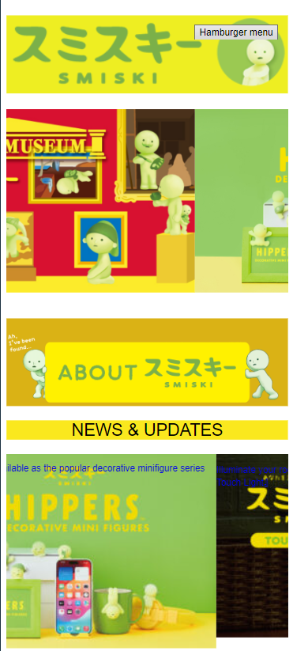
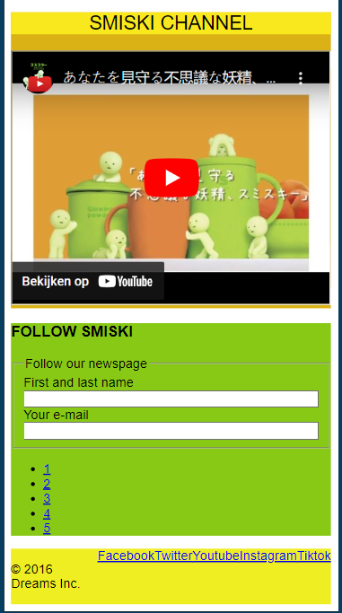

### Agenda voor meeting

We zijn niet samen gaan zitten omdat iedereen heel specifieke vragen had voor zijn of haar website en er zowat niks overheen kwam.

### Verslag van meeting

hier na afloop snel de uitkomsten van de meeting vastleggen

- Bij de news en updates section kan alles in een list gezet worden om het makkelijker vorm te geven.
- Margin gebruiken bij de image sliders om ruimte ertussen te creeën.
- De images moeten hight hebben om allemaal even groot te zijn.
- De bovenste image slideshow is niet scroll, maar een transition. Het is wel handig om het toch scroll te houden tenzij je echt nog een animatie nodig hebt.
- Bij scroll snap moet je op de items zelf "scroll-snap-align: start;" zetten om het te laten werken.
- De product images kan je met flex-wrap en padding laten werken, door het bovenste item padding te geven en dus alleen die dan aan te spreken.

## Eindgesprek (week 5)

  
uitwerken voor eindgesprek

### Je uitkomst - karakteristiek screenshots:

  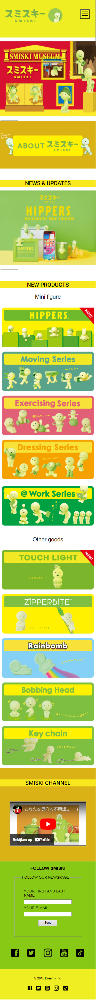
  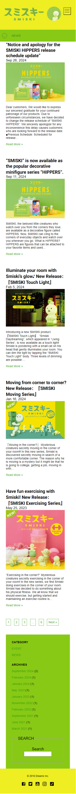

### Dit ging goed/Heb ik geleerd:

Korte omschrijving met plaatjes:

De responsiveness op de news pagina ging goed en is op alle grotes goed te gebruiken. Daarnaast is de nav bar makkelijker en beter gelukt dan ik had verwacht, ondanks hij niet helemaal is zoals ik had gewild.

  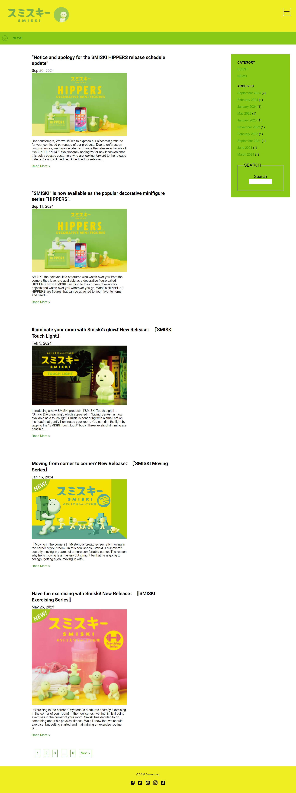
  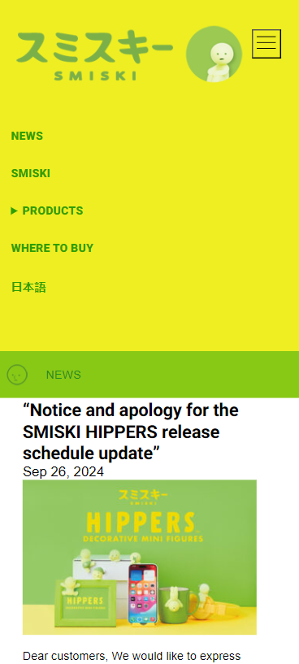

### Dit was lastig/Is niet gelukt:

Ik had heel veel moeite met de slideshow responsive te maken doordat de img's verschillende grotes hadden en niet wouden meewerken. Daardoor is de resposiveness van de home pagina niet zo goed als ik had gehoopt. Er zijn gewoon veel dingen waarvoor ik niet de tijd had om ze verder uit te werken, terwijl ik dat wel graag had gedaan. Daarnaast speelde er in mijn familie ook nog dingen waardoor ik minder tijd had dan gehoopt. Hierdoor is mijn CSS niet zoals ik had gehoopt.

  
  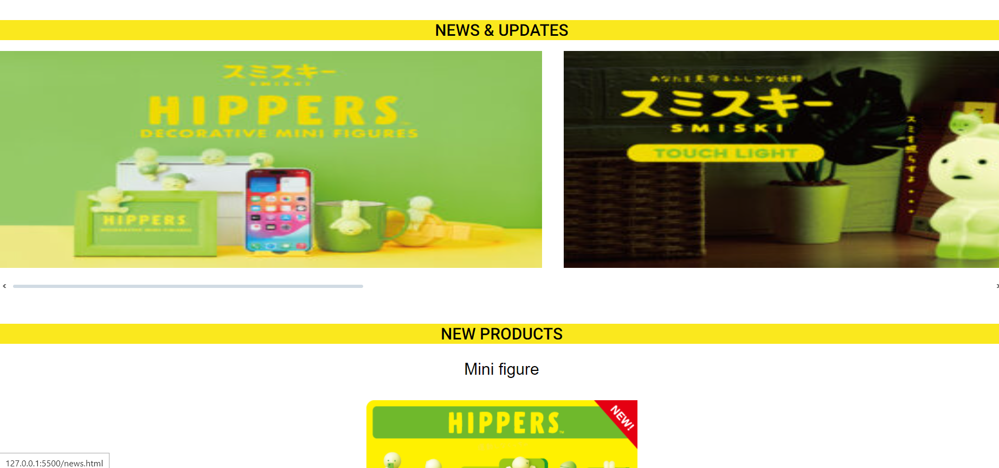

## Bronnenlijst

  
continu bijhouden terwijl je werkt

Nb. Wees specifiek ('css-tricks' als bron is bijv. niet specifiek genoeg).
Nb. ChatGpT en andere AI horen er ook bij.
Nb. Vermeld de bronnen ook in je code.

1. Bron van allemaal code: https://codepen.io/your-work
2. Bron voor social icon svg's: https://www.svgrepo.com
3. Bron voor grid items: https://cssgridgarden.com/#nl
4. Bron voor flexbox items: https://flexboxfroggy.com/#nl
5. Hamburger menu SVG: https://icons8.com/icons/set/hamburger-menu
6. Roboto font: https://fonts.google.com/specimen/Roboto

